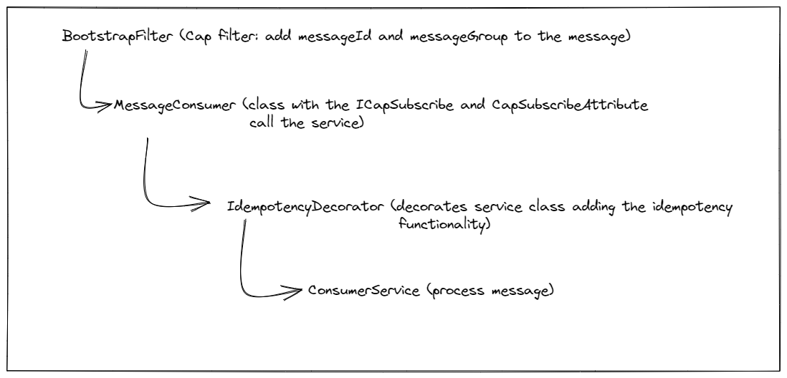

# CAP.Contrib.Idempotency



## Run tests

```shell
docker compose up -d sqlserver
dotnet test
```

## Decorator pattern

This library uses the [decorator pattern](https://refactoring.guru/design-patterns/decorator/csharp/example) to add the idempotency enforcement to the consumer services.

# Example

https://github.com/rafaelpadovezi/Ecommerce.Poc/pull/1